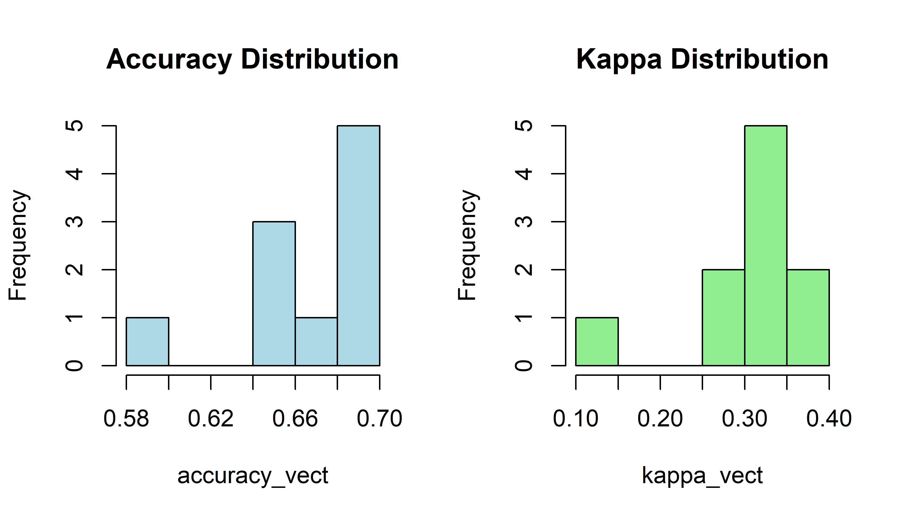
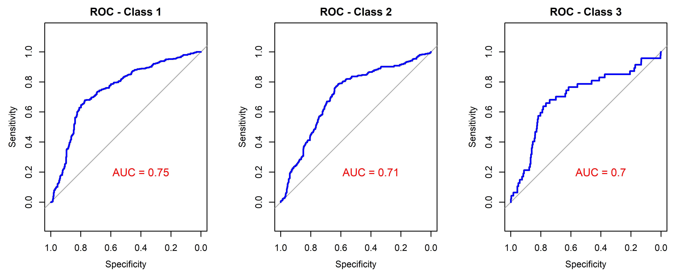
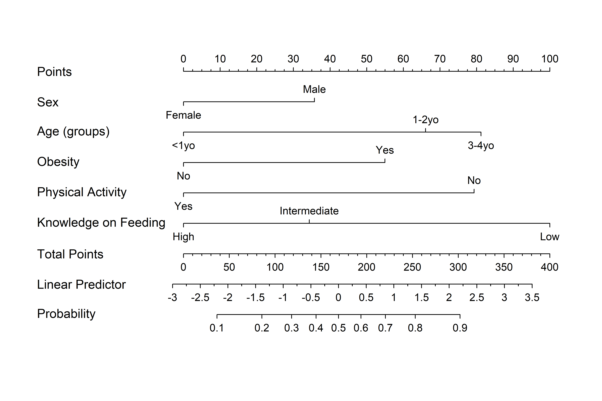

<style>
h2 {
  color: #0073e6;
}
</style>

# 1. Calling packages and reading input files

## 1.1. Calling Required Packages

<details>
<summary style="background-color:#104E8B; color:white; padding:10px; border-radius:6px; cursor:pointer; font-weight:bold;">Hide/Show Code</summary>

```{r call libraries, warning=FALSE, message=FALSE}
library(caret)
library(dplyr)
library(DynNom)
library(effects)
library(gtsummary)
library(MASS)
library(pROC)
library(readxl)
library(rmarkdown)
library(rms)
library(tidyverse)
set.seed(1233)

```
</details> 

<br> <br>
```{r sp1}

```
## 1.2. Reading data files

his analysis started with one file including information of **442 children**. This file can be found in the 'Input files' folder.

<details>
<summary style="background-color:#104E8B; color:white; padding:10px; border-radius:6px; cursor:pointer; font-weight:bold;">Hide/Show Code</summary>
```{r read1.2}

#Loading expression data
read_excel('Input File/BASE_OF.xlsx')->data

#Formatting data
data%>%
  mutate(SEX=factor(SEX,levels=c('1','2')),
         Age_Group=factor(Age_Group,levels=c('1','2','3')),
         Age_months=as.numeric(Age_months),
         EDI=factor(EDI,levels=c('1','2','3')),
         Obesity=factor(Obesity,levels=c('0','1')),
         Anemia=factor(Anemia,levels=c('0','1')),
         PhysActiv=factor(PhysActiv,levels=c('0','1')),
         KnowFeeding=factor(KnowFeeding,levels=c('1','2','3')),
         MotherAge=as.numeric(MotherAge),
         EDULevel=factor(EDULevel,levels=c('1','2','3','4','5'))
         )->data
data->data_calculator

```
</details>

<br> <br>
```{r sp2}

```
\newpage
___

# 2. Clinical Profile

Firstly, we show a main profile of all variables according to their EDI categories:
(1): Normal, (2): Developmental Risk, (3): Developmental Issue

```{r sum2.1}
data%>%
  tbl_summary(      
    statistic = list(
      all_continuous() ~ "{mean} ({sd})",
      all_categorical() ~ "{n} / {N} ({p}%)"
    ),
    digits = all_continuous() ~ 2,
    include = c("Code","SEX","Age_Group","Age_months","Obesity" ,   
                "Anemia"   ,   "PhysActiv","KnowFeeding","MotherAge","EDULevel" ),
    by = EDI, # split table by group
    missing = "no" # don't list missing data separately
  ) |> 
  add_overall()|> 
  add_n() |> # add column with total number of non-missing observations
  add_p(test = all_categorical() ~ "chisq.test") |> # test for a difference between groups
  bold_labels()
```
\newpage
___

# 3. Ordinal logistic regression

To analyze the contributions of selected variables to the neurodevelopmental process in children, we used ordinal logistic regression considering the conventional categories used in the EDI: (1),(2), and (3).

```{r polr3.1}

# Building up the model

data_model <- polr(EDI ~ SEX+Age_Group+Age_months+Obesity+
                              Anemia+PhysActiv+KnowFeeding+MotherAge+EDULevel,
                       data = data, Hess = TRUE)

# Evaluating the model
# sumamry(data_model)
ctable <- coef(summary(data_model))
pvalores <- pnorm(abs(ctable[, "t value"]), lower.tail = FALSE) * 2
ctable <- cbind(ctable, "p value" = round(pvalores, 4))
print(ctable)
```
<br>

According to this table, **Sex, Age groups, Obesity, Physical Activity, and Knowledge of Feeding** contribute to the EDI score (p<0.05). Then, the next models will include only these variables.

\newpage
___

# 4. Testing models in a bootstrap-applied model

In this section, we used previously selected variables to test models using randomly stratified training (80%) and validation (20%) cohorts within our dataset. We run this process 1000 times and plot the summary of the Area Under the Curve (AUC), accuracy and Cohen’s kappa statistics.

<details>
<summary style="background-color:#104E8B; color:white; padding:10px; border-radius:6px; cursor:pointer; font-weight:bold;">Hide/Show Code</summary>
```{r test4.1}
# Number of iterations
n_reps <- 10

# Saving metrics
accuracy_vect <- numeric(n_reps)
kappa_vect <- numeric(n_reps)
labels_acu <- c()
pred_acu <- c()
probs_acu <- data.frame()

for (i in 1:n_reps) {
  
  # Random splitting training/validation cohorts
  trainIndex <- createDataPartition(data$EDI, p = 0.8, list = FALSE)
  training_data <- data[trainIndex, ]
  validation_data <- data[-trainIndex, ]
  
  # Traning the model
  data_model <- polr(EDI ~ SEX+Age_Group+Age_months+Obesity+
                              Anemia+PhysActiv+KnowFeeding+MotherAge+EDULevel,
                       data = training_data, Hess = TRUE)
  
  # Predicting results
  predictions <- predict(data_model, newdata = validation_data)
  probes <- predict(data_model, newdata = validation_data, type = "probs")
  
  # Evaluating parameters
  cm <- confusionMatrix(predictions, validation_data$EDI)
  accuracy_vect[i] <- cm$overall["Accuracy"]
  kappa_vect[i] <- cm$overall["Kappa"]
  
  # Saving results
  labels_acu <- c(labels_acu, as.character(validation_data$EDI))
  pred_acu <- c(pred_acu, as.character(predictions))
  probs_acu <- rbind(probs_acu, probes)
  
}

```
</details>
<br><br>

After these 1000 simulations, we obtained a mean value of **`r paste0(round(mean(accuracy_vect)*100,2),"% (",round(min(accuracy_vect)*100,2),"%-",round(max(accuracy_vect)*100,2),"%)")` accuracy** and **`r paste0(round(mean(kappa_vect)*100,2),"% (",round(min(kappa_vect)*100,2),"%-",round(max(kappa_vect)*100,2),"%)")` Cohen’s kappa statistic** 

In addition, we can generate the following plots (histograms and AUC curves):

<details>
<summary style="background-color:#104E8B; color:white; padding:10px; border-radius:6px; cursor:pointer; font-weight:bold;">Hide/Show Code</summary>
```{r test4.2}

# Histograms from Accuracy and Kappa 
png('Results/Accuracy and Kappa.png',width=3800,height = 2200,res=600)
par(mfrow = c(1, 2)) 
hist(accuracy_vect, main = "Accuracy Distribution", col = "lightblue")
hist(kappa_vect, main = "Kappa Distribution", col = "lightgreen")
dev.off()

# Generating AUC


# Checking labels
labels_factor <- factor(labels_acu, levels = levels(data$EDI))

# Using pROC
auc_multi <- multiclass.roc(response = labels_factor, predictor = as.matrix(probs_acu))


par(mfrow = c(1, 3))  

nivels <- levels(data$EDI)


#Saving plot
png('Results/AUC.png',width=5000,height = 2000,res=600)
par(mfrow = c(1, 3))
for (class in nivels) {
  
  # Setting Binary Labels (1 when it matches, 0 when it doesn't match)
  binary_response <- ifelse(labels_factor == class, 1, 0)
  
  if (length(unique(binary_response)) == 2) {
    
    # ROC_curve
    roc_class <- roc(binary_response, probs_acu[[class]])
    auc_value <- round(auc(roc_class), 3)
    
    # Plotting ROC
    plot(roc_class,
         main = paste("ROC - Class", class),
         col = "blue",
         lwd = 2)
    
    # Adding AUC values
    text(x = 0.4, y = 0.2, labels = paste("AUC =", round(auc_value,2)), col = "red", cex = 1.2)
    
    } else {
    cat("Class", class, "have insufficient data\n")
  }
}
dev.off()
```
</details>
<br><br>

Finally, we can visualize these plots.

**Histograms for Accuracy and Kappa statistics**

```{r plots1, echo=FALSE }



```
<br> <br>

**AUC curves**

```{r plots2, echo=FALSE }



```
<br> <br>


\newpage
___

# 5. Generation of the nomogram and virtual calculator

Finally, using this pre-established model, we developed a nomogram including the variables previously presented: **Sex, Age groups, Obesity, Physical Activity, and Knowledge of Feeding**

```{r nomogram5.1}
# Setting labels

data$SEX <- factor(data$SEX, levels = c(1,2), labels = c("Male","Female"))
data$Age_Group <- factor(data$Age_Group, levels = c(1, 2, 3), 
                         labels = c("<1yo", "1-2yo", "3-4yo"))
data$Obesity <- factor(data$Obesity, levels = c(0, 1), labels = c("No", "Yes"))
data$PhysActiv <- factor(data$PhysActiv, levels = c(0, 1), labels = c("No", "Yes"))
data$KnowFeeding <- factor(data$KnowFeeding, levels = c(1,2,3), labels = c("Low", "Intermediate","High"))

label(data$SEX)         <- "Sex"
label(data$Age_Group)   <- "Age (groups)"
label(data$Obesity)     <- "Obesity"
label(data$PhysActiv)   <- "Physical Activity"
label(data$KnowFeeding) <- "Knowledge on Feeding"


dd <- datadist(data)
options(datadist = "dd")

# setting the model
rms_model <- lrm(EDI ~ SEX+Age_Group+Obesity+
                        PhysActiv+KnowFeeding,
                  data = data)
nom <- nomogram(rms_model,
                fun = function(x) plogis(x),  
                funlabel = "Probability")

#Plotting the nomogram
png('Results/nomogram.png',width=4800,height = 3200,res=600)
plot(nom, xfrac = .4)
dev.off()
```
<br>
```{r plots3, echo=FALSE }



```
<br> <br>

and also created a virtual calculator using **DynNom**

<details>
<summary style="background-color:#104E8B; color:white; padding:10px; border-radius:6px; cursor:pointer; font-weight:bold;">Hide/Show Code</summary>
```{r nomogram5.2, eval=FALSE}

#Loading data
read_excel('Input File/BASE_OF.xlsx')->data

#Formatting data
data%>%
  mutate(SEX=factor(SEX,levels=c('1','2')),
         Age_Group=factor(Age_Group,levels=c('1','2','3')),
         Age_months=as.numeric(Age_months),
         EDI=factor(EDI,levels=c('1','2','3')),
         Obesity=factor(Obesity,levels=c('0','1')),
         Anemia=factor(Anemia,levels=c('0','1')),
         PhysActiv=factor(PhysActiv,levels=c('0','1')),
         KnowFeeding=factor(KnowFeeding,levels=c('1','2','3')),
         MotherAge=as.numeric(MotherAge),
         EDULevel=factor(EDULevel,levels=c('1','2','3','4','5'))
  )->data
# Setting labels

data$SEX <- factor(data$SEX, levels = c(1,2), labels = c("Male","Female"))
data$Age_Group <- factor(data$Age_Group, levels = c(1, 2, 3), 
                         labels = c("<1yo", "1-2yo", "3-4yo"))
data$Obesity <- factor(data$Obesity, levels = c(0, 1), labels = c("No", "Yes"))
data$PhysActiv <- factor(data$PhysActiv, levels = c(0, 1), labels = c("No", "Yes"))
data$KnowFeeding <- factor(data$KnowFeeding, levels = c(1,2,3), labels = c("Low", "Intermediate","High"))

lookup <- c(Sex = "SEX", 'Age_groups' = "Age_Group",
            "Physical_Activity"='PhysActiv',
            "Knowledge_on_Feeding"='KnowFeeding')

rename(data, all_of(lookup))->data


dd <- datadist(data)
options(datadist = "dd")


model <- glm(EDI ~ Sex + Age_groups+Obesity+Physical_Activity+Knowledge_on_Feeding,data=data, family=binomial)


DNbuilder(
  model, 
  data = data, 
  clevel = 0.95,
  DNtitle = 'Neurodevelopmental Disorders in Children'
)

# Using shinylive and 
shinylive::export(appdir = "DynNomapp", destdir = "docs")
#httpuv::runStaticServer("docs")

```
</details>
<br>
<br>

To run the interactive DynNom calculator, click below:

👉 [Run the DynNom Calculator App]()
