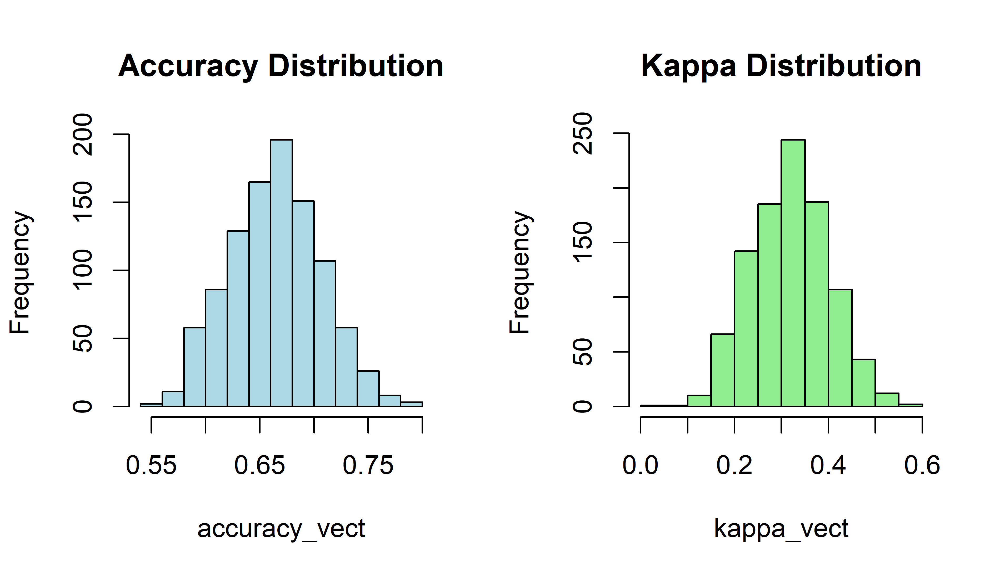
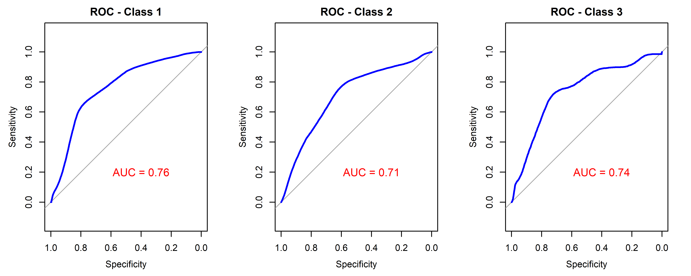

<style>
h2 {
  color: #0073e6;
}
</style>

# 1. Calling packages and reading input files

## 1.1. Calling Required Packages

<details>
<summary style="background-color:#104E8B; color:white; padding:10px; border-radius:6px; cursor:pointer; font-weight:bold;">Hide/Show Code</summary>

```{r call libraries, warning=FALSE, message=FALSE}
library(caret)
library(dplyr)
library(effects)
library(gtsummary)
library(MASS)
library(pROC)
library(readxl)
library(rmarkdown)
library(rms)
library(tidyverse)
set.seed(1233)

```
</details> 

<br> <br>
```{r sp1}

```
## 1.2. Reading data files

his analysis started with one file including information of **442 children**. This file can be found in the 'Input files' folder.

<details>
<summary style="background-color:#104E8B; color:white; padding:10px; border-radius:6px; cursor:pointer; font-weight:bold;">Hide/Show Code</summary>
```{r read1.2}

#Loading expression data
read_excel('Input File/BASE_OF.xlsx')->data

#Formatting data
data%>%
  mutate(SEX=factor(SEX,levels=c('1','2')),
         Age_Group=factor(Age_Group,levels=c('1','2','3')),
         Age_months=as.numeric(Age_months),
         EDI=factor(EDI,levels=c('1','2','3')),
         Obesity=factor(Obesity,levels=c('0','1')),
         Anemia=factor(Anemia,levels=c('0','1')),
         PhysActiv=factor(PhysActiv,levels=c('0','1')),
         KnowFeeding=factor(KnowFeeding,levels=c('1','2','3')),
         MotherAge=as.numeric(MotherAge),
         EDULevel=factor(EDULevel,levels=c('1','2','3','4','5'))
         )->data
data->data_calculator

```
</details>

<br> <br>
```{r sp2}

```
\newpage
___

# 2. Clinical Profile

Firstly, we show a main profile of all variables according to their EDI categories:
(1): Normal, (2): Developmental Risk, (3): Developmental Issue

```{r sum2.1}
data%>%
  tbl_summary(      
    statistic = list(
      all_continuous() ~ "{mean} ({sd})",
      all_categorical() ~ "{n} / {N} ({p}%)"
    ),
    digits = all_continuous() ~ 2,
    include = c("Code","SEX","Age_Group","Age_months","Obesity" ,   
                "Anemia"   ,   "PhysActiv","KnowFeeding","MotherAge","EDULevel" ),
    by = EDI, # split table by group
    missing = "no" # don't list missing data separately
  ) |> 
  add_overall()|> 
  add_n() |> # add column with total number of non-missing observations
  add_p(test = all_categorical() ~ "chisq.test") |> # test for a difference between groups
  bold_labels()
```
\newpage
___

# 3. Ordinal logistic regression

To analyze the contributions of selected variables to the neurodevelopmental process in children, we used ordinal logistic regression considering the conventional categories used in the EDI: (1),(2), and (3).

```{r polr3.1}

# Building up the model

data_model <- polr(EDI ~ SEX+Age_Group+Age_months+Obesity+
                              Anemia+PhysActiv+KnowFeeding+MotherAge+EDULevel,
                       data = data, Hess = TRUE)

# Evaluating the model
# sumamry(data_model)
ctable <- coef(summary(data_model))
pvalores <- pnorm(abs(ctable[, "t value"]), lower.tail = FALSE) * 2
ctable <- cbind(ctable, "p value" = round(pvalores, 4))
print(ctable)
```
<br>

According to this table, **Sex, Age groups, Obesity, Physical Activity, and Knowledge of Feeding** contribute to the EDI score (p<0.05). Then, the next models will include only these variables.

\newpage
___

# 4. Testing models in a bootstrap-applied model

In this section, we used previously selected variables to test models using randomly stratified training (80%) and validation (20%) cohorts within our dataset. We run this process 1000 times and plot the summary of the Area Under the Curve (AUC), accuracy and Cohen’s kappa statistics.

<details>
<summary style="background-color:#104E8B; color:white; padding:10px; border-radius:6px; cursor:pointer; font-weight:bold;">Hide/Show Code</summary>
```{r test4.1}
# Number of iterations
n_reps <- 10

# Saving metrics
accuracy_vect <- numeric(n_reps)
kappa_vect <- numeric(n_reps)
labels_acu <- c()
pred_acu <- c()
probs_acu <- data.frame()

for (i in 1:n_reps) {
  
  # Random splitting training/validation cohorts
  trainIndex <- createDataPartition(data$EDI, p = 0.8, list = FALSE)
  training_data <- data[trainIndex, ]
  validation_data <- data[-trainIndex, ]
  
  # Traning the model
  data_model <- polr(EDI ~ SEX+Age_Group+Age_months+Obesity+
                              Anemia+PhysActiv+KnowFeeding+MotherAge+EDULevel,
                       data = training_data, Hess = TRUE)
  
  # Predicting results
  predictions <- predict(data_model, newdata = validation_data)
  probes <- predict(data_model, newdata = validation_data, type = "probs")
  
  # Evaluating parameters
  cm <- confusionMatrix(predictions, validation_data$EDI)
  accuracy_vect[i] <- cm$overall["Accuracy"]
  kappa_vect[i] <- cm$overall["Kappa"]
  
  # Saving results
  labels_acu <- c(labels_acu, as.character(validation_data$EDI))
  pred_acu <- c(pred_acu, as.character(predictions))
  probs_acu <- rbind(probs_acu, probes)
  
}

```
</details>
<br><br>

After these 1000 simulations, we obtained a mean value of **`r paste0(round(mean(accuracy_vect)*100,2),"% (",round(min(accuracy_vect)*100,2),"%-",round(max(accuracy_vect)*100,2),"%)")` accuracy** and **`r paste0(round(mean(kappa_vect)*100,2),"% (",round(min(kappa_vect)*100,2),"%-",round(max(kappa_vect)*100,2),"%)")` Cohen’s kappa statistic** 

In addition, we can generate the following plots (histograms and AUC curves):

<details>
<summary style="background-color:#104E8B; color:white; padding:10px; border-radius:6px; cursor:pointer; font-weight:bold;">Hide/Show Code</summary>
```{r test4.2}

# Histograms from Accuracy and Kappa 
png('Results/Accuracy and Kappa.png',width=3800,height = 2200,res=600)
par(mfrow = c(1, 2)) 
hist(accuracy_vect, main = "Accuracy Distribution", col = "lightblue")
hist(kappa_vect, main = "Kappa Distribution", col = "lightgreen")
dev.off()

# Generating AUC


# Checking labels
labels_factor <- factor(labels_acu, levels = levels(data$EDI))

# Using pROC
auc_multi <- multiclass.roc(response = labels_factor, predictor = as.matrix(probs_acu))


par(mfrow = c(1, 3))  

nivels <- levels(data$EDI)


#Saving plot
png('Results/AUC.png',width=5000,height = 2000,res=600)
par(mfrow = c(1, 3))
for (class in nivels) {
  
  # Setting Binary Labels (1 when it matches, 0 when it doesn't match)
  binary_response <- ifelse(labels_factor == class, 1, 0)
  
  if (length(unique(binary_response)) == 2) {
    
    # ROC_curve
    roc_class <- roc(binary_response, probs_acu[[class]])
    auc_value <- round(auc(roc_class), 3)
    
    # Plotting ROC
    plot(roc_class,
         main = paste("ROC - Class", class),
         col = "blue",
         lwd = 2)
    
    # Adding AUC values
    text(x = 0.4, y = 0.2, labels = paste("AUC =", round(auc_value,2)), col = "red", cex = 1.2)
    
    } else {
    cat("Class", class, "have insufficient data\n")
  }
}
dev.off()
```
</details>
<br><br>

Finally, we can visualize these plots.

**Histograms for Accuracy and Kappa statistics**

```{r plots1, echo=FALSE }



```
<br> <br>

**AUC curves**

```{r plots2, echo=FALSE }



```
<br> <br>


\newpage
___

# 5. Generation of the nomogram and virtual calculator

Finally, using this pre-established model, we developed a nomogram including the variables previously presented: **Sex, Age groups, Obesity, Physical Activity, and Knowledge of Feeding**

```{r nomogram5.1}
# Setting labels

data$SEX <- factor(data$SEX, levels = c(1,2), labels = c("Male","Female"))
data$Age_Group <- factor(data$Age_Group, levels = c(1, 2, 3), 
                         labels = c("<1yo", "1-2yo", "3-4yo"))
data$Obesity <- factor(data$Obesity, levels = c(0, 1), labels = c("No", "Yes"))
data$PhysActiv <- factor(data$PhysActiv, levels = c(0, 1), labels = c("No", "Yes"))
data$KnowFeeding <- factor(data$KnowFeeding, levels = c(1,2,3), labels = c("Low", "Intermediate","High"))

label(data$SEX)         <- "Sex"
label(data$Age_Group)   <- "Age (groups)"
label(data$Obesity)     <- "Obesity"
label(data$PhysActiv)   <- "Physical Activity"
label(data$KnowFeeding) <- "Knowledge on Feeding"


dd <- datadist(data)
options(datadist = "dd")

# setting the model
rms_model <- lrm(EDI ~ SEX+Age_Group+Obesity+
                        PhysActiv+KnowFeeding,
                  data = data)
nom <- nomogram(rms_model,
                fun = function(x) plogis(x),  
                funlabel = "Probability")

#Plotting the nomogram
png('Results/nomogram.png',width=4800,height = 3200,res=600)
plot(nom, xfrac = .4)
dev.off()
```
<br>
```{r plots3, echo=FALSE }


```
<br> <br>

and also created a virtual calculator using **shinyPredict**

<details>
<summary style="background-color:#104E8B; color:white; padding:10px; border-radius:6px; cursor:pointer; font-weight:bold;">Hide/Show Code</summary>
```{r nomogram5.2, eval=FALSE}

 library(shiny) 
 library(ggplot2) 
 library(DT) 
 library(survival) 
 library(splines) 
 library(shinythemes) 
 library(ggthemes) 
 library(Epi) 
 # Load list of models 
 load(file="models.RData") 
 lv.malli.value<-as.character(seq(tmp.mallit)) 
 names(lv.malli.value)<-sapply(tmp.mallit,function(x){as.character(formula(x))[3]}) 
 tmp.dt.AIC<-data.frame(Model=sapply(tmp.mallit,function(x){as.character(formula(x))[3]}),
                                      AIC=sapply(tmp.mallit,function(x)AIC(x))) 
 tmp.dt.AIC<-tmp.dt.AIC[order(tmp.dt.AIC$AIC),] 
 tmp.dt.AIC$Relative.likelihood<-exp((tmp.dt.AIC$AIC[1]-tmp.dt.AIC$AIC)/2) 
 # Time variable name 
 lv.i.coxph<-sum(class(tmp.mallit[[1]])%in%'coxph') 
 lv.time<-gsub(x=strsplit(x=strsplit(x=as.character(formula(tmp.mallit[[1]]))[2],split = "\\(")[[1]][2],
                          split=",")[[1]][1],pattern = "\\)",replacement = "") 
 # X-variable names 
 tmp.otsikko<-names(tmp.mallit) 
 if(is.null(tmp.otsikko)){Models.otsikko<-paste0("Model ",seq(length(tmp.mallit)))} 
 if(!is.null(tmp.otsikko)){Models.otsikko<-ifelse(tmp.otsikko=="",paste0("Model ",seq(length(tmp.mallit))),tmp.otsikko)} 
 # Osa 1 loppu 
lv.xvars<-c("SEX", "Age_Group", "Obesity", "PhysActiv", "KnowFeeding")
# Osa 1A alku 
 # Data frame containing predictions 
 tee.dt<-function(input){ 
     lv.dt<-expand.grid( 
 # Osa 1A loppu 
SEX=factor(input$SEX,levels=c("Male","Female")),
Age_Group=factor(input$Age_Group,levels=c("<1yo","1-2yo","3-4yo")),
Obesity=factor(input$Obesity,levels=c("No","Yes")),
PhysActiv=factor(input$PhysActiv,levels=c("No","Yes")),
KnowFeeding=factor(input$KnowFeeding,levels=c("Low","Intermediate","High"))# Osa 2 alku 
     ) 
     lv.class<-class(tmp.mallit[[as.numeric(input$Model)]]) 
     if(sum(lv.class%in%"coxph")>0){ 
         lv.pred<-predict(tmp.mallit[[as.numeric(input$Model)]],newdata=lv.dt,se.fit = TRUE,type="survival") 
     } 
     if(sum(lv.class%in%c("lm","glm"))>0){lv.pred<-predict(tmp.mallit[[as.numeric(input$Model)]],newdata=lv.dt,se.fit = TRUE,type="response")} 
     lv.dt$Predicted<-lv.pred$fit 
     lv.dt$se.fit<-lv.pred$se.fit 
     lv.dt$Predicted.lo<-lv.pred$fit-1.96*lv.pred$se.fit 
     lv.dt$Predicted.hi<-lv.pred$fit+1.96*lv.pred$se.fit 
     if(sum(lv.class%in%"coxph")>0){ 
          lv.dt$Predicted.lo<-ifelse(lv.dt$Predicted.lo<0,0,lv.dt$Predicted.lo) 
      } 
     lv.dt 
 } 
 # Define UI for application that draws a histogram 
 ui <- fluidPage(theme = shinytheme( 
 "readable"), 
     # Application title 
     titlePanel( 
 "Neurodevelopmental disorder in Children"), 
     # Sidebar with a slider input 
     sidebarLayout( 
         sidebarPanel( 
             #textAreaInput("AddPlot",label="Add plot script",value="",rows=3), 
             #actionButton("Toteuta", label="Submit"), 
             radioButtons("Model",label="Select model", 
                              choices=lv.malli.value,inline=FALSE), 
             # Osa 2 loppu 
radioButtons(inputId="SEX", label="Sex",
 choices=c("Male"="Male","Female"="Female"), selected = "Male"),
radioButtons(inputId="Age_Group", label="Age (groups)",
 choices=c("<1yo"="<1yo","1-2yo"="1-2yo","3-4yo"="3-4yo"), selected = "<1yo"),
radioButtons(inputId="Obesity", label="Obesity",
 choices=c("No"="No","Yes"="Yes"), selected = "No"),
radioButtons(inputId="PhysActiv", label="Physical Activity",
 choices=c("No"="No","Yes"="Yes"), selected = "No"),
radioButtons(inputId="KnowFeeding", label="Knowledge on Feeding",
 choices=c("Low"="Low","Intermediate"="Intermediate","High"="High"), selected = "Low"),            # Osa 3 alku 
         ), 
         mainPanel( 
             tabsetPanel(id='tabs', 
                 tabPanel("Plot",plotOutput("distPlot")), 
                 tabPanel("Data", dataTableOutput("Data")), 
                tabPanel("Summary", verbatimTextOutput("Summary")), 
                 tabPanel("AIC", htmlOutput("AICTab")), 
                 tabPanel("Info",htmlOutput("Info")) 
         ) 
     ) 
 )) 
 # Define server logic required to draw a histogram 
 server <- function(input, output, session) { 
  
     output$distPlot <- renderPlot({ 
         tmp.dt<-tee.dt(input) 
         #browser()
         colore<-hsv(runif(1), 1, 1)
          lv.txt<-paste("lv.p1<-ggplot(tmp.dt,aes(x=1,y=Predicted))+geom_line(color=colore)+geom_point(color=colore)+
                        geom_errorbar(aes(ymin = tmp.dt$Predicted.lo, ymax = tmp.dt$Predicted.hi),width = 0.1,color=colore)+
                        geom_ribbon(aes(ymin = tmp.dt$Predicted.lo, ymax = tmp.dt$Predicted.hi), alpha=.2,color=colore)+
                        coord_flip()+theme_bw()+
                        geom_text(aes(x=1.2,y=Predicted),label=paste0(round(tmp.dt$Predicted,2),
                        ' (',round(tmp.dt$Predicted.lo,2),'-',
                        round(tmp.dt$Predicted.hi,2),')'),size=3.5)+
                        scale_x_continuous(name='',limits=c(0.5,1.5),breaks=c(0,2))+
                        scale_y_continuous(name='Prediction',limits=c(-0.2,1.2),breaks=c(0,0.25,0.5,0.75,1))") 
         
          eval(parse(text=lv.txt)) 
          
         input$Toteuta 

         lv.p1 
     },width=800,height=500,res=300) 
     output$Data<-DT::renderDataTable({ 
         tmp.dt<-tee.dt(input) 
     tmp.title<-'Data and predictions' 
 DT::datatable(tmp.dt,
                           extensions = 'Buttons',escape=TRUE,
                           options = list(
                             pageLength = 50,
                             dom = 'Blfrtip',
                             buttons = list(
                               list(extend = 'copy', title = tmp.title),
                               list(extend = 'csv', title = tmp.title),
                               list(extend = 'excel', title = tmp.title),
                               list(extend = 'pdf', title = tmp.title)
                             )
                           )) 
     }) 
     output$AICTab<- renderPrint({ 
       knitr::kable(tmp.dt.AIC,format='html',caption='Compring models with AIC') 
      }) 
     output$Summary<- renderPrint({ 
      if(sum(class(tmp.mallit[[as.numeric(input$Model)]])%in%"coxph")>0)lv.testi<-cox.zph(tmp.mallit[[as.numeric(input$Model)]]) 
     else{lv.testi<-NULL} 
         tmp.ulos.S<-list(summary(tmp.mallit[[as.numeric(input$Model)]]),lv.testi) 
          if(is.null(lv.testi)) {names(tmp.ulos.S)<-c('Model','')} 
          if(!is.null(lv.testi)) {names(tmp.ulos.S)<-c('Model','Testing PH assumption')} 
         cat("\n Current model:" ,Models.otsikko[as.numeric(input$Model)],"\n\n") 
         tmp.ulos.S 
     }) 
     output$Info<-renderText({ 
          HTML( scan(quiet=TRUE,file="ModelInfo.html",what=""))}) 
 } 
 # Run the application 
 shinyApp(ui = ui, server = server) 

# Using shinylive and 
shinylive::export(appdir = "ShinyApp", destdir = "docs")
#httpuv::runStaticServer("docs")

```
</details>
<br>
<br>

To run the interactive shinyPredict calculator, click below:

👉 [Run the DynNom Calculator App]()
